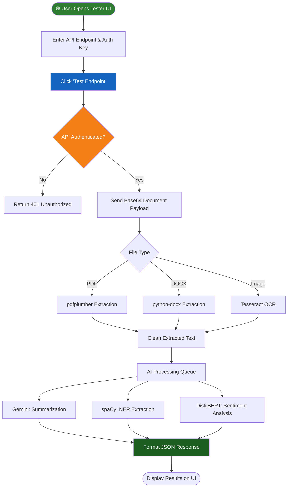

<div align="center">

# 📄 DocAnalyse AI — API Endpoint Tester

### *AI-Powered Document Analysis & Extraction — GUVI Hackathon 2026 Intern Hiring*

[](https://python.org)
[](https://fastapi.tiangolo.com/)
[](https://reactjs.org/)
[](https://vitejs.dev/)
[](https://docs.celeryq.dev/)
[](https://aistudio.google.com/)
[](LICENSE)
[](CONTRIBUTING.md)

> 🚀 **An intelligent document processing system and API endpoint tester** built for the GUVI Hackathon 2026. This platform allows participants to validate their API for AI-Powered Document Analysis & Extraction, testing authentication, document processing, and structured JSON responses.

</div>

---

## 📋 Table of Contents

- [📌 Problem Statement](#-problem-statement)
- [💡 Solution & Approach](#-solution--approach)
- [🎯 Objectives](#-objectives)
- [🛠️ Technology Stack](#️-technology-stack)
- [📁 Project Structure](#-project-structure)
- [🔬 How It Works — System Flowchart](#-how-it-works--system-flowchart)
- [💻 Code Analysis](#-code-analysis)
- [📦 Dependencies](#-dependencies)
- [🚀 Installation & Setup](#-installation--setup)
- [🎬 System Demo](#-system-demo)
- [🌍 Impact & Real-World Significance](#-impact--real-world-significance)
- [🔮 Future Enhancements](#-future-enhancements)
- [🤝 Open Source Contribution](#-open-source-contribution)
- [📄 License](#-license)
- [👨‍💻 Author & Acknowledgments](#-author--acknowledgments)

---

## 📌 Problem Statement

> **"GUVI Hackathon 2026 challenges developers to build production-quality applications over an intensive sprint. Participants choose one of three engineering tracks and deliver a fully functional, hosted solution."**

### Background

Track: **AI-Powered Document Analysis & Extraction – API Endpoint Tester (Active)**

This endpoint tester allows participants to validate their API for the AI-Powered Document Analysis & Extraction. Participants can test authentication, request handling, document analyzing & extraction, and response structure by sending apikey to their deployed API endpoint before final evaluation. The request data will be sent from our side.

### The Core Problem

| Challenge | Description |
|-----------|-------------|
| 🔴 **API Authentication Validation** | Ensuring headers with valid API keys are correctly authenticated |
| 🔴 **Multi-format Processing** | Receiving and processing `pdf`, `docx`, and `image` input accurately |
| 🔴 **Request Parsing** | Correctly handling and parsing complex Base64 encoded document payloads |
| 🔴 **JSON Formatting** | Maintaining a strictly structured JSON response for summarization and entities |
| 🔴 **Stability & Behavior** | Guaranteeing robust API stability during rigorous automated testing |

*Note: This tester is for validation purposes only. The final evaluation uses a separate automated system with official samples.*

---

## 💡 Solution & Approach

### Our Strategy

We designed a robust, full-stack endpoint tester combining a FastAPI backend and a React/Vite frontend. It acts as both a comprehensive processing engine and an interactive test harness:

1. **Dual functionality** — Serves as a reference implementation of the extraction logic *and* a GUI to test endpoints.
2. **Interactive UI (Endpoint Tester)** — A frontend to enter the deployed API URL, provide the API key, and trigger test payloads.
3. **AI Pipeline** — Integration with Google Gemini, spaCy NER, and DistilBERT for intelligent extraction.
4. **Asynchronous Architecture** — Uses Celery and Redis to process heavy document extraction tasks efficiently.

### Architecture Overview

```text
[Participant / User]
        ↓  Enters Endpoint URL & API Key
[React/Vite Frontend]
        ↓  Sends Test Payloads
[Deployed Participant API] <--- OR ---> [Local Reference API (FastAPI)]
                                                ↓
                                      [Celery Task Queue (Redis)]
                                                ↓
                                [AI Models: Gemini / spaCy / DistilBERT]
```

---

## 🎯 Objectives

- ✅ **Provide an Endpoint Tester UI** for participants to validate their APIs
- ✅ **Test API authentication** via header keys
- ✅ **Support multiple formats** (PDF, DOCX, Images)
- ✅ **Ensure correct JSON structures** for summaries, named entities, and sentiment
- ✅ **Establish a highly performant reference backend** using FastAPI and Celery
- ✅ **Foster open-source collaboration** by providing clear contribution guidelines

---

## 🛠️ Technology Stack

### Backend & Database

| Component | Specification | Role |
|-----------|--------------|------|
| **Framework** | FastAPI 0.95+ | High-performance async REST API framework |
| **Language** | Python 3.10+ | Core backend logic |
| **Task Queue** | Celery & Redis | Distributed asynchronous document processing |
| **AI (LLM)** | Google Gemini 2.5 Flash | Text summarization |
| **AI (NLP)** | spaCy `en_core_web_sm` | Named Entity Recognition (NER) |
| **AI (Sentiment)**| HuggingFace DistilBERT | Text sentiment classification |
| **Extraction** | pdfplumber, python-docx, pytesseract | Parsing multi-format documents |

### Frontend & Deployment

| Technology | Version | Purpose |
|--------------------|---------|---------|
| **React** | 19.2+ | Modern UI component library |
| **Vite** | 8.0+ | Fast build tool and development server |
| **Styling** | Tailwind CSS 4.2 | Utility-first rapid styling |
| **HTTP Client** | Axios | Managing API endpoint calls |

---

## 📁 Project Structure

```text
doc-ai/
│
├── 📁 backend/                         # FastAPI Python Backend
│   ├── 📁 ai/                          # AI integration (Gemini, spaCy, DistilBERT)
│   ├── 📁 routes/                      # API Endpoints (health, analyze, chat)
│   ├── 📁 services/                    # Business logic & extraction algorithms
│   ├── 📄 main.py                      # FastAPI App Entry Point
│   ├── 📄 tasks.py                     # Celery task definitions
│   └── 📄 requirements.txt             # Python dependencies
│
├── 📁 frontend/                        # React + Vite UI
│   ├── 📁 src/                         # React components and views
│   ├── 📁 public/                      # Static assets
│   ├── 📄 package.json                 # Node dependencies
│   ├── 📄 vite.config.js               # Vite build configuration
│   └── 📄 index.html                   # Main HTML template
│
├── 📁 vector_store/                    # Persisted FAISS indexes for RAG sessions
├── 📄 HOW_TO_RUN.txt                   # Quick-start guide
└── 📄 README.md                        # Documentation (You are here)
```

---

## 🔬 How It Works — System Flowchart



### Step-by-Step Operation

| Step | Action | Description |
|------|--------|-------------|
| 1 | **Configure Tester** | Enter your deployed API endpoint URL and providing the `x-api-key`. |
| 2 | **Trigger Request** | Click "Test Endpoint" to dispatch sample base64 payloads to your API. |
| 3 | **Authentication Check** | The target API validates the headers. Invalid keys must return HTTP 401. |
| 4 | **Extraction** | The API processes the payload, handling PDF, DOCX, or Image logic. |
| 5 | **AI Inference** | The API generates a summary, extracts entities (names, dates), and predicts sentiment. |
| 6 | **Validation** | The tester verifies the returned JSON structure matches the expected schema. |

---

## 💻 Code Analysis

### Main Architecture Decisions

#### Async Processing (`backend/tasks.py`)
```python
@celery_app.task(bind=True)
def process_document_task(self, document_data):
    # Offloads heavy AI and extraction tasks from the main thread
    # ensuring the FastAPI server remains highly responsive
    result = document_service.run_pipeline(document_data)
    return result
```

#### API Route Security (`backend/routes/analyze.py`)
```python
# Securing the API endpoint using a mandatory dependency
async def verify_api_key(x_api_key: str = Header(...)):
    if x_api_key != settings.expected_api_key:
        raise HTTPException(status_code=401, detail="Unauthorized")
```

### Design Decisions

| Decision | Rationale |
|----------|-----------|
| **FastAPI + Uvicorn** | Selected for native async support, vital for I/O bound LLM network calls. |
| **Celery + Redis** | Prevents timeouts when processing large multi-page PDF documents. |
| **React + Vite** | Provides a blazing fast, hot-reloading frontend to build the Tester UI. |
| **Modular AI Tools** | Separating Gemini (Summarization), spaCy (NER), and HuggingFace (Sentiment) ensures the best tool is used for each specific task. |

---

## 📦 Dependencies

### Backend Dependencies (`backend/requirements.txt`)
```text
fastapi>=0.95.0
uvicorn>=0.22.0
celery>=5.3.0
redis>=4.6.0
pdfplumber>=0.9.0
python-docx>=0.8.11
pytesseract>=0.3.10
spacy>=3.6.0
transformers>=4.30.0
```

### Frontend Dependencies (`frontend/package.json`)
```json
"dependencies": {
  "axios": "^1.14.0",
  "react": "^19.2.4",
  "react-dom": "^19.2.4"
},
"devDependencies": {
  "tailwindcss": "^4.2.2",
  "vite": "^8.0.1"
}
```

---

## 🚀 Installation & Setup

### Prerequisites

- Python 3.10+
- Node.js 18+ & npm
- Redis Server
- Tesseract OCR

### 1. Clone the Repository

```bash
git clone https://github.com/your-username/doc-extract-api.git
cd doc-extract-api
```

### 2. Configure Backend

```bash
cd backend
python -m venv venv
# Activate venv (Windows: venv\Scripts\activate | Mac/Linux: source venv/bin/activate)
pip install -r requirements.txt
python -m spacy download en_core_web_sm
```

Set up your `.env` file in the `backend` folder:
```env
GEMINI_API_KEY=your_gemini_key
API_SECRET_KEY=sk_track2_test
CELERY_BROKER_URL=redis://localhost:6379/0
```

Start the Backend Services:
```bash
# Terminal 1: Redis
redis-server

# Terminal 2: Celery Worker
celery -A tasks worker --loglevel=info

# Terminal 3: FastAPI Server
uvicorn main:app --host 0.0.0.0 --port 8000 --reload
```

### 3. Configure Frontend

```bash
cd ../frontend
npm install
npm run dev
```

### 4. Access the Tester

Open your browser and navigate to: `http://localhost:5173` (or the port provided by Vite).

---

## 🎬 System Demo

### How to Use the Endpoint Tester

This tool helps participants verify that their API endpoint is working as expected for the GUVI Hackathon 2026.

**Steps:**
1. Enter your deployed API endpoint URL (e.g., `https://your-app.onrender.com/api/analyze`)
2. Provide the required Authorization / API key in the header input field
3. Click **Test Endpoint** to send the request
4. View the real-time parsing logs and final JSON response formatting

**What This Tests:**
- API authentication using headers
- Ability to receive and process pdf/docx/image input
- Correct request parsing and validation
- Proper JSON response formatting
- API stability and response behavior

---

## 🌍 Impact & Real-World Significance

### Who Benefits

| Stakeholder | Benefit |
|-------------|---------|
| 👨‍💻 **Hackathon Participants** | Immediate feedback on API structure, saving hours of debugging during evaluations |
| ⚖️ **Evaluators/Judges** | Standardized, automated way to verify hundreds of participant submissions |
| 🏢 **Enterprise Businesses** | The core extraction technology can automate invoice processing and contract review |

### System vs. Traditional Approach

| Manual Testing Approach | Smart Endpoint Tester |
|-------------------------|-----------------------|
| Writing custom cURL scripts | **1-Click GUI Testing** |
| Guessing JSON schema errors | **Visual Schema Validation** |
| Slow manual file uploads | **Automated Base64 Payload Injection** |

---

## 🔮 Future Enhancements

- [ ] **Batch Processing Test** — Validate multiple documents simultaneously.
- [ ] **Latency Metrics** — Display API response time and throughput in the UI.
- [ ] **Expanded OCR Support** — Integrate AWS Textract or Azure Document Intelligence fallback.
- [ ] **Webhook Integrations** — Allow the tester to receive async callback responses.

---

## 🤝 Open Source Contribution

We warmly welcome contributions from the community! This project thrives on open-source collaboration. Whether you are fixing bugs, improving the UI, or adding new AI features, your help is appreciated. 🎉

### Best Practices for Open Source Contributors

If you want to be a stellar open-source contributor to this project, follow these guidelines:

1. **Check Issues First:** Look at the 'Issues' tab on GitHub. Good first issues are tagged with `good first issue` or `help wanted`.
2. **Communicate:** Before building a massive new feature, open an Issue to discuss it with the maintainers.
3. **Write Tests:** If you add a new feature, add a unit test or API test to ensure it doesn't break in the future.
4. **Clean Commits:** Use descriptive, conventional commit messages (e.g., `feat: add latency metric to UI` or `fix: handle corrupted PDF gracefully`).

### How to Add Features & Use It

```bash
# 1. Fork the repository on GitHub

# 2. Clone your fork
git clone https://github.com/YOUR_USERNAME/doc-extract-api.git

# 3. Create a feature branch
git checkout -b feature/your-feature-name

# 4. Make your changes and commit
git commit -m "feat: added latency tracking to frontend"

# 5. Push to your fork
git push origin feature/your-feature-name

# 6. Open a Pull Request → main branch on GitHub
```

### Contribution Areas

| Area | Good First Issue? | Description |
|------|------------------|-------------|
| 🐛 **Bug Fixes** | ✅ Yes | Fix edge cases in OCR or base64 decoding |
| ➕ **UI Enhancements** | ✅ Yes | Improve Tailwind CSS styling and responsiveness |
| 📚 **Documentation** | ✅ Yes | Enhance this README or add inline docstrings |
| 🤖 **AI Features** | 🔥 Advanced | Integrate new NLP models for deeper extraction |

---

## 📄 License
This project is licensed under the Apache License 2.0 — you are free to use, modify, and distribute this code with proper attribution and compliance with the license terms.


```text
Apache License
Version 2.0, January 2004
http://www.apache.org/licenses/

Copyright (c) 2026 Arokiya Nithish J

Licensed under the Apache License, Version 2.0 (the "License");
you may not use this file except in compliance with the License.
You may obtain a copy of the License at

```
http://www.apache.org/licenses/LICENSE-2.0  
```

Unless required by applicable law or agreed to in writing, software
distributed under the License is distributed on an "AS IS" BASIS,
WITHOUT WARRANTIES OR CONDITIONS OF ANY KIND, either express or implied.
See the License for the specific language governing permissions and
limitations under the License.

```

See [LICENSE](LICENSE) for full details.

---

## 👨‍💻 Author & Acknowledgments

### Author

**Arokiya Nithish J**
- Role: Full Stack AI Developer
- 📅 Year: 2026
- 🎓 Engineering Student
- 💼 Domain: Python | FastAPI | React | AI Integration | Rag |Agentic Ai

**Contacts**
- GitHub: [@ArokiyaNithish](https://github.com/ArokiyaNithish)
- LinkedIn: [@Arokiya Nithish J](https://www.linkedin.com/in/arokiya-nithishj/)
- Email: arokiyanithishj@gmail.com
- Portfolio: [arokiyanithish.github.io/portfolio](https://arokiyanithish.github.io/portfolio/)

### Acknowledgments

- 🏫 **GUVI Hackathon 2026** — For providing the exciting problem statement.
- 🍃 **FastAPI & React Ecosystems** — For the robust frameworks powering the system.
- 🤖 **Google DeepMind & AI Studio** — For providing cutting-edge models.

---
## 📜 NOTICE

```
NOTICE

Project Name: DocAnalyse AI
Copyright (c) 2026 Arokiya Nithish J

This product includes software developed by Arokiya Nithish J.

Licensed under the Apache License, Version 2.0 (the "License");
you may not use this file except in compliance with the License.
You may obtain a copy of the License at:

    http://www.apache.org/licenses/LICENSE-2.0

Unless required by applicable law or agreed to in writing, software
distributed under the License is distributed on an "AS IS" BASIS,
WITHOUT WARRANTIES OR CONDITIONS OF ANY KIND, either express or implied.
See the License for the specific language governing permissions and
limitations under the License.

---

Third-Party Attributions

This project may include or depend on third-party libraries.
Attributions and licenses for those components are listed below:

* FastAPI — Copyright (c) 2018 Sebastián Ramírez
  Licensed under MIT License
  Source: https://github.com/tiangolo/fastapi

* React — Copyright (c) Meta Platforms, Inc. and affiliates.
  Licensed under MIT License
  Source: https://github.com/facebook/react

* Celery — Copyright (c) 2015-2026 Ask Solem and contributors.
  Licensed under BSD 3-Clause License
  Source: https://github.com/celery/celery

* spaCy — Copyright (c) 2016-2026 ExplosionAI UG (haftungsbeschränkt)
  Licensed under MIT License
  Source: https://github.com/explosion/spaCy

---

Modifications

If you have modified this project, you should add a statement here such as:

"This project has been modified by <Your Name/Organization> on <Date>.
Changes include: <brief description of changes>"

---

END OF NOTICE
```

---
<div align="center">

For support, email arokiyanithishj@gmail.com or open an issue on GitHub.

### 🌟 If this project helped you — please give it a ⭐ Star on GitHub!

**#Python #FastAPI #React #AI #Hackathon #OpenSource #GUVI2026**

*Made with ❤️ by Arokiya Nithish*

*© 2026 — Arokiya Nithish J*

</div>


